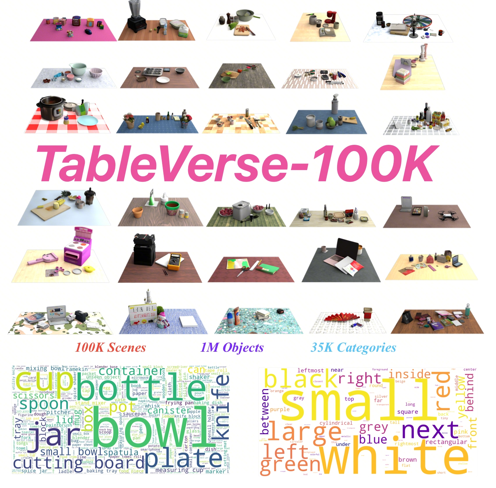

# TableVerse: A Large-scale Tabletop Dataset with Real-world Grounded Layouts for Generalizable Manipulation

[](https://arxiv.org/abs/2607.21017)
[](https://arxiv.org/pdf/2607.21017)
[](https://huggingface.co/datasets/ByteDance/TableVerse)
[](https://bytedance.github.io/TableVerse)



## TODO

- ✅ Release TableVerse-100K dataset

## Citation

```bibtex
@article{wang2026tableverse,
  title={TableVerse: A Large-scale Tabletop Dataset with Real-world Grounded Layouts for Generalizable Manipulation},
  author={Wang, Boyuan and Zhang, Yue and Xue, Xutao and Song, Xueyu and Sun, Yu},
  journal={arXiv preprint arXiv:2607.21017},
  year={2026}
}
```

## Security

If you discover a potential security issue in this project, or think you may
have discovered a security issue, we ask that you notify Bytedance Security via our [security center](https://security.bytedance.com/src) or [vulnerability reporting email](mailto:sec@bytedance.com).

## License

This project is licensed under the [Apache-2.0 License](LICENSE).
